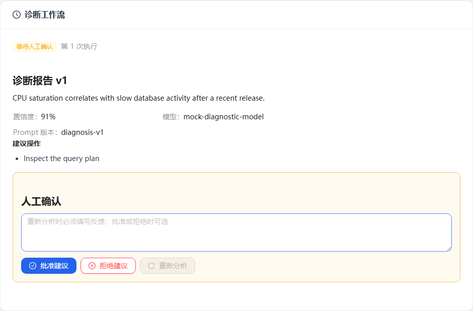

# Alert Sage

Alert Sage 是一个面向运维场景的 AI 告警诊断助手，以“告警接入 → 上下文采集 → 根因分析 → 人工确认 → 案例沉淀”为核心链路。

项目定位是用于求职展示的准生产级 MVP：核心流程真实可运行，状态可恢复，异常可观测，同时避免为了堆叠技术栈过早引入微服务和 Kubernetes。

## 当前状态

`V2.7C 求职展示资产包`：核心告警闭环、事务性 Outbox、DeepSeek/Dify 适配、结构化可观测性和 RAG 评测报告均已完成。版本化离线演示可以稳定复现工具部分失败、人工确认和案例沉淀，Playwright 在独立 Compose 环境中验证主路径并自动生成脱敏展示截图。

## 一分钟了解

这个项目重点展示的不是“让大模型回答一个告警”，而是如何把不可靠的模型和外部工具放进可恢复、可审计、有人类控制点的工程流程：

- LangGraph 在 PostgreSQL checkpoint 上暂停并恢复七节点诊断流程。
- 事务性 Outbox 保证业务事实与 Celery 投递意图一起提交。
- 单个工具超时不会伪造证据，其他上下文仍可生成结构化报告。
- 人工批准后生成结构化案例，并通过可替换适配器异步同步知识库。
- Dify、DeepSeek、日志、指标和 CMDB 均隔离在供应商适配器之外。



完整架构图、五分钟讲解顺序和面试追问见 [求职展示指南](docs/09-portfolio-showcase.md)。图中内容来自版本化 Mock 演示，不代表真实 Dify 或 DeepSeek 调用结果。

## 技术栈

- 后端：Python 3.12、FastAPI、LangGraph、Celery、SQLAlchemy、Alembic、uv
- 前端：React、TypeScript、Vite、Ant Design、TanStack Query
- 数据：PostgreSQL、Redis
- 交付：Docker Compose、pytest、Vitest、Playwright、Prometheus、Grafana
- 外部知识：Dify Knowledge Base API（可替换）
- 诊断模型：DeepSeek OpenAI-compatible API（可替换）
- 可选扩展：pgvector 对照实现、真实运维数据源、认证与 RBAC

## Docker 一键启动

```powershell
Copy-Item .env.example .env
docker compose up --build
```

启动后访问：

- Web：http://localhost:15173
- API 文档：http://localhost:18000/docs
- API 健康检查：http://localhost:18000/api/v1/health/live
- API 就绪检查：http://localhost:18000/api/v1/health/ready
- API 指标：http://localhost:18000/metrics
- Worker 指标：http://localhost:19101/metrics
- Prometheus：http://localhost:19090
- Grafana：http://localhost:13000/d/alert-sage-overview

停止服务：

```powershell
docker compose down
```

## 确定性演示

在 Windows PowerShell 中运行：

```powershell
.\scripts\start-demo.ps1
```

命令会启动离线演示覆盖环境、创建固定 CPU 告警、运行诊断并停在人工确认节点。使用 `-Approve` 可自动批准并等待案例同步完成：

```powershell
.\scripts\start-demo.ps1 -Approve
```

演示入口不会读取或调用 `.env` 中的 Dify/DeepSeek 密钥，也不会删除已有数据。完整边界和验收方式见 [确定性演示环境](docs/07-demo-environment.md)。

生成版本化展示截图：

```powershell
.\scripts\capture-showcase.ps1
```

该命令使用 V2.7B 的隔离环境自动覆盖 `docs/assets/showcase/` 中的三张主路径截图，不访问日常开发数据库或云端供应商。

## 端到端验收

首次准备根目录测试依赖和 Chromium：

```powershell
npm ci
npm run e2e:install
```

运行隔离的完整浏览器验收：

```powershell
.\scripts\run-e2e.ps1
```

脚本使用独立的 `alert-sage-e2e` Compose project、专用端口和临时 PostgreSQL/Redis Volume，结束后自动清理，不会读写日常开发数据库。完整边界、覆盖范围和故障取证方式见 [端到端测试](docs/08-e2e-testing.md)。

## 本地开发

后端：

```powershell
Set-Location backend
uv sync --python 3.12
uv run alembic upgrade head
uv run uvicorn app.main:app --reload
```

前端：

```powershell
Set-Location frontend
npm ci
npm run dev
```

质量检查：

```powershell
Set-Location backend
uv run ruff check .
uv run ruff format --check .
uv run pytest

Set-Location ../frontend
npm run api:types
npm run typecheck
npm test
npm run build
```

## 目录

```text
backend/          FastAPI、SQLAlchemy、Alembic 和后端测试
frontend/         React/Vite Web 应用和前端测试
docs/             项目范围、架构、数据模型和路线图
infra/            Prometheus 抓取与 Grafana provisioning/Dashboard
scripts/          本地演示和工程编排入口
docker-compose.yml
docker-compose.demo.yml
```

## 文档

- [项目范围与验收标准](docs/01-project-scope.md)
- [技术选型与架构设计](docs/02-architecture.md)
- [核心数据模型](docs/03-data-model.md)
- [开发路线图](docs/04-roadmap.md)
- [本地开发与验证](docs/05-development.md)
- [RAG 评测设计](docs/06-rag-evaluation.md)
- [确定性演示环境](docs/07-demo-environment.md)
- [端到端测试](docs/08-e2e-testing.md)
- [求职展示指南](docs/09-portfolio-showcase.md)
