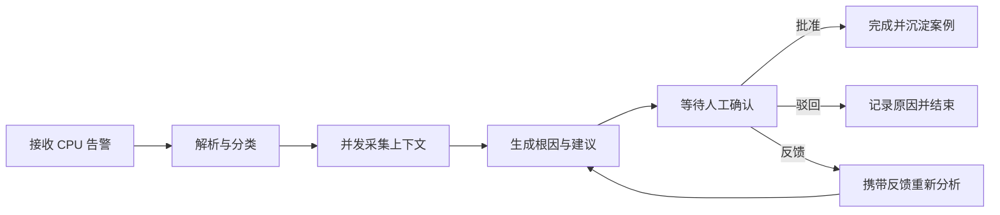

# 项目范围与验收标准

## 1. 项目定位

Alert Sage 是一个求职展示型、准生产级 MVP。它不是只调用一次大模型的聊天 Demo，而是包含持久化状态、人工介入、工具调用、知识检索和案例沉淀的完整运维闭环。

项目目标：

> 构建一个面向运维场景的 AI 告警助手，能够接收告警，结合日志、监控指标、CMDB 和知识库完成诊断，生成人工可确认的处置建议，并将确认后的处理过程沉淀为历史案例。

## 2. 第一版核心场景

第一版只实现“服务 CPU 使用率持续过高”场景，以有限范围验证完整链路。

示例输入：

```json
{
  "external_alert_id": "alert-20260718-001",
  "alert_name": "HighCPUUsage",
  "service": "order-service",
  "instance": "order-service-01",
  "severity": "critical",
  "value": 92.5,
  "threshold": 80,
  "started_at": "2026-07-18T14:30:00+08:00"
}
```

诊断时查询四类上下文：

- 指标：CPU、内存、请求量、错误率和响应时间。
- 日志：异常堆栈、超时、慢查询及近期部署事件。
- CMDB：服务负责人、实例信息、依赖关系和部署版本。
- 知识与案例：CPU 排查手册及相似历史告警。

## 3. 核心业务闭环



人工确认可通过 Web 或飞书卡片完成，两者都复用后端状态机和 PostgreSQL 业务事实。Web 仍是完整详情与故障兜底，飞书只承载通知、主要状态和受控操作。Web 端包含：

1. 告警列表：展示等级、服务、状态、当前节点和创建时间。
2. 告警详情：展示原始告警、工具证据、工作流事件和诊断报告。
3. 确认面板：支持批准、驳回、填写意见后重新分析。

## 4. 功能范围

### 4.1 必须实现

- 告警创建、列表和详情查询。
- 基于外部告警 ID 的幂等创建。
- 七阶段告警工作流：解析、分类、排查、根因、建议、确认、沉淀。
- 四类模拟工具并发调用，包含超时、重试和部分失败降级。
- LangGraph checkpoint 持久化及人工中断/恢复。
- 诊断报告包含结论、置信度、证据和建议。
- 人工批准、驳回和重新分析。
- 确认后的案例入库。
- Dify 知识库检索适配器。
- SSE 推送节点状态。
- 结构化日志、工作流事件和基础 Prometheus 指标。
- 显式 `real/demo/test` 运行 Profile，真实模式强制 DeepSeek 与 Dify。
- 飞书企业自建应用的共享告警卡片、手动启动、审批、驳回、重新分析和私有提醒。

### 4.2 暂不实现

- 自动登录服务器执行命令。
- 自动重启、发布、扩缩容等高风险动作。
- 真实企业 CMDB、日志平台和监控平台接入。
- 多租户及复杂 RBAC。
- 大规模告警聚合与抑制。
- Kubernetes 部署和微服务拆分。
- 多 Agent 自主协作。
- 群消息解析、通讯录读取和多群/多租户飞书路由。

这些能力可以作为后续扩展，不阻塞第一版闭环。

## 5. 状态定义

告警对外状态：

| 状态 | 含义 |
| --- | --- |
| `received` | 告警已持久化，等待执行 |
| `running` | 工作流正在执行 |
| `waiting_for_approval` | 已生成报告，等待人工决策 |
| `reanalyzing` | 携带人工反馈重新诊断 |
| `completed` | 已批准并生成数据库案例；外部知识库同步独立进行 |
| `rejected` | 人工驳回并结束 |
| `failed` | 工作流发生不可恢复错误 |

人工决策类型：

- `approve`：批准当前建议，继续沉淀案例。
- `reject`：驳回当前报告，记录原因并结束。
- `reanalyze`：携带反馈重新进入根因分析节点。

## 6. 第一阶段验收标准

- 相同 `source + external_alert_id` 重复提交不会创建第二条告警。
- 每个根因结论至少关联一项日志、指标、CMDB 或知识库证据。
- 工作流等待确认时重启 API/Worker，仍可继续执行。
- 单个上下文工具失败时，工作流记录错误并降级生成报告。
- 同一次工具调用在任务重试或恢复后不会产生重复副作用。
- 批准后生成结构化案例，知识库同步状态可查询且失败可重试。
- 接入真实知识库后，已同步案例可被后续知识检索命中。
- 页面能够展示当前节点、节点耗时、工具状态和错误原因。
- 一次完整演示可在 3 至 5 分钟内完成。
- 真实 Profile 不创建 Mock 供应商，缺失配置时启动失败且错误不泄露密钥。
- 飞书重复事件、重复按钮和 Web/飞书并发操作不创建重复业务事实。
- 飞书不可用只产生可重试的渠道失败，不改变告警或工作流事实。

## 7. 求职展示重点

项目重点展示三类能力：

1. **有状态 Agent 编排**：持久化、人工介入、恢复、分支和重试。
2. **可靠后端工程**：幂等、异步任务、并发工具调用、降级和可观测性。
3. **可评测 RAG**：检索来源可追溯，能够对比分段、TopK 和检索实现。
