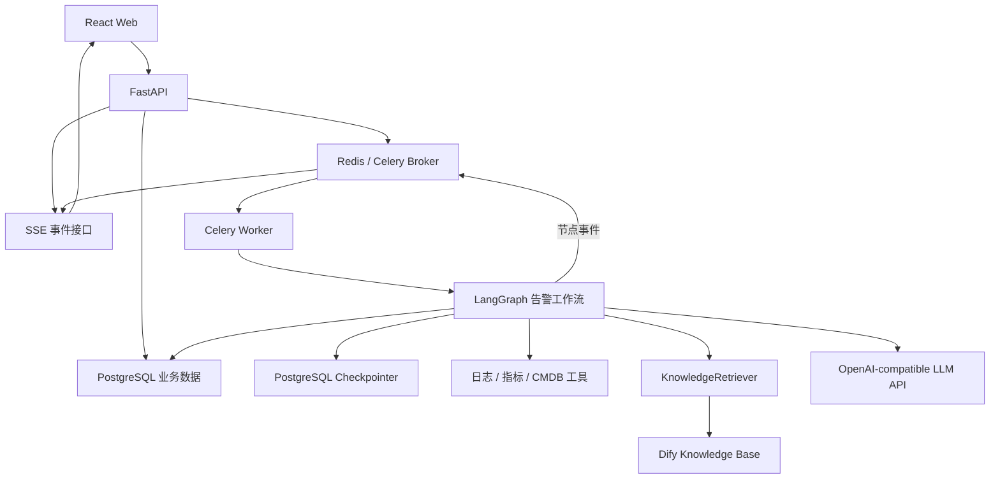
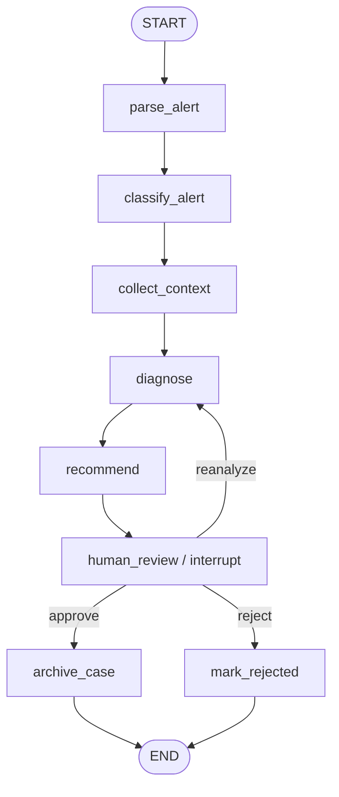

# 技术选型与架构设计

## 1. 架构原则

- 核心告警流程由代码控制，便于测试、版本管理和故障恢复。
- 业务事实、执行快照和临时调度状态分离。
- 第一版采用模块化单体与独立 Worker，不拆微服务。
- 外部系统通过适配器接入，Dify、模型和模拟工具均可替换。
- 数据库是最终事实来源，Redis 不保存不可丢失的业务状态。

## 2. 技术选型

| 层级 | 选型 | 职责 |
| --- | --- | --- |
| Web | React、TypeScript、Vite、Ant Design | 告警列表、详情、确认页面 |
| Web 数据层 | TanStack Query、SSE | 查询缓存、状态刷新、服务端事件 |
| API | FastAPI、Pydantic | 接口、校验、鉴权和任务投递 |
| 数据访问 | SQLAlchemy、Alembic | ORM 和数据库迁移 |
| Agent | LangGraph | 告警工作流、人工中断和恢复 |
| 异步执行 | Celery | 启动/恢复工作流及后台任务 |
| 临时基础设施 | Redis | Celery Broker、缓存、锁和事件发布 |
| 业务存储 | PostgreSQL | 告警、报告、决策、案例和审计事件 |
| 工作流快照 | LangGraph PostgreSQL Checkpointer | checkpoint 与恢复 |
| 第一版 RAG | Dify Knowledge Base API | 文档管理、分段和检索 |
| 进阶 RAG | pgvector | 自研混合检索与效果对比 |
| 可观测性 | Prometheus、Grafana、结构化日志 | 指标、看板和排障 |
| 交付 | Docker Compose | 本地一键启动 |
| 测试 | pytest、Playwright | 单元、集成和端到端测试 |

第一版不引入 Milvus、Kafka、Elasticsearch 和 Kubernetes。当前数据规模下，额外运维成本大于展示收益；需要自研向量检索时优先使用 pgvector。

## 3. 组件职责边界

### 3.1 LangGraph 与 Celery

- LangGraph 决定“下一步执行什么”，维护告警诊断的业务控制流。
- Celery 决定“任务在哪里、何时执行”，负责把 HTTP 请求与耗时工作解耦。
- Celery 的任务结果不是业务事实；页面状态来自 PostgreSQL。
- 工作流暂停时 Celery 任务结束，人工决策到达后创建新的恢复任务。

### 3.2 PostgreSQL 与 Redis

- PostgreSQL 保存告警、运行记录、节点事件、报告、决策和案例。
- LangGraph Checkpointer 在 PostgreSQL 保存可恢复执行快照。
- Redis 用于队列、缓存、短期锁和事件广播，可清空、可重建。
- 告警幂等最终由数据库唯一约束保证，Redis 只能作为快速拦截层。

### 3.3 Dify 的定位

Dify 只作为可替换的知识检索服务，不编排核心告警工作流。

后端定义统一的检索接口：

```python
class KnowledgeRetriever:
    async def retrieve(
        self,
        query: str,
        top_k: int,
        filters: dict | None = None,
    ) -> list[DocumentChunk]:
        ...
```

第一版实现：

- `DifyRetriever`：调用 Dify Knowledge Base API。
- `MockRetriever`：测试和离线开发使用。

后续实现 `PgVectorRetriever`，用同一评测集对比两种检索方案。LangGraph 节点只依赖 `KnowledgeRetriever`，不感知 Dify 的响应格式。

## 4. 总体架构



## 5. 告警工作流



`collect_context` 内部并发调用日志、指标、CMDB 和知识检索工具。每个工具具有独立的超时、重试、错误记录和幂等键。部分工具失败时保留已取得的证据，并在报告中声明信息缺失。

`human_review` 使用持久化 checkpoint。恢复执行时节点可能重新进入，因此暂停前的写操作必须幂等，外部副作用应放在人工批准之后。

## 6. Web 与 API

第一版接口：

| 方法 | 路径 | 用途 |
| --- | --- | --- |
| `POST` | `/api/v1/alerts` | 创建模拟告警 |
| `GET` | `/api/v1/alerts` | 查询告警列表 |
| `GET` | `/api/v1/alerts/{id}` | 查询告警详情 |
| `GET` | `/api/v1/alerts/{id}/events` | 获取节点和工具事件 |
| `GET` | `/api/v1/alerts/{id}/stream` | 订阅 SSE 状态事件 |
| `POST` | `/api/v1/alerts/{id}/decisions` | 批准、驳回或重新分析 |
| `POST` | `/api/v1/alerts/{id}/retry` | 重试失败工作流 |

人工决策请求：

```json
{
  "action": "approve",
  "comment": "确认是慢查询导致，可以按照建议处理"
}
```

SSE 用于服务器向浏览器单向推送状态，审批仍使用普通 HTTP 请求。需要双向高频交互前不引入 WebSocket。

## 7. 建议目录结构

```text
alert-sage/
├─ backend/
│  ├─ app/
│  │  ├─ api/v1/routes/          # 告警、决策、事件和健康检查接口
│  │  ├─ core/                   # 配置、异常、日志和安全
│  │  ├─ db/                     # Session、数据库初始化
│  │  ├─ models/                 # SQLAlchemy 持久化模型
│  │  ├─ schemas/                # Pydantic API/领域数据结构
│  │  ├─ repositories/           # 数据访问边界
│  │  ├─ services/               # 应用服务和事务编排
│  │  ├─ workflows/alert/
│  │  │  ├─ graph.py             # LangGraph 图定义
│  │  │  ├─ state.py             # 工作流状态结构
│  │  │  └─ nodes/               # 解析、采集、诊断、确认、沉淀节点
│  │  ├─ tools/                  # 日志、指标、CMDB、案例工具
│  │  ├─ integrations/
│  │  │  ├─ dify/                # Dify 检索适配器
│  │  │  └─ llm/                 # 模型适配器
│  │  ├─ tasks/                  # Celery 任务与 Worker 入口
│  │  └─ observability/          # 指标、追踪和审计辅助代码
│  ├─ migrations/                # Alembic 迁移
│  └─ tests/
│     ├─ unit/
│     ├─ integration/
│     └─ fixtures/
├─ frontend/
│  ├─ src/
│  │  ├─ api/                    # API Client 与 SSE Client
│  │  ├─ components/             # 通用组件
│  │  ├─ features/alerts/        # 告警领域页面和组件
│  │  ├─ pages/                  # 列表、详情和创建页面
│  │  ├─ routes/                 # 路由定义
│  │  └─ types/                  # TypeScript 数据类型
│  └─ tests/                     # 前端测试
├─ tests/e2e/                    # Playwright 端到端测试
├─ docs/                         # 设计与使用文档
├─ infra/
│  ├─ prometheus/                # Prometheus 配置
│  └─ grafana/                   # Dashboard 与数据源配置
├─ scripts/                      # 初始化、导入样例和演示脚本
├─ docker-compose.yml
├─ .env.example
└─ README.md
```

API 和 Celery Worker 共享 `backend/app` 中的领域与工作流代码，只使用不同启动入口。第一版不建立多个后端服务仓库。

## 8. 可观测性

建议第一版提供：

- `alert_workflow_total{status,severity}`
- `alert_workflow_duration_seconds`
- `workflow_node_duration_seconds{node}`
- `tool_calls_total{tool,status}`
- `tool_call_duration_seconds{tool}`
- `workflow_interrupt_total{action}`
- `llm_request_total{model,status}`
- `llm_tokens_total{model,type}`
- `rag_retrieval_duration_seconds{provider}`
- `rag_retrieval_results{provider}`

所有日志包含 `alert_id`、`workflow_run_id`、`thread_id`、`node` 和 `request_id`，便于串联一次诊断链路。

## 9. 可靠性约束

- API 先提交数据库事务，再投递任务；投递失败应记录并允许补偿重试。
- 每次工具调用使用稳定的 `idempotency_key`。
- LLM 输出必须经过结构化 Schema 校验，失败时允许修复或重试。
- 重试仅覆盖可恢复错误，不对参数错误和权限错误盲目重试。
- 人工决策只能作用于 `waiting_for_approval` 的运行。
- 最终报告、人工决策和案例写入均保留版本与审计信息。
