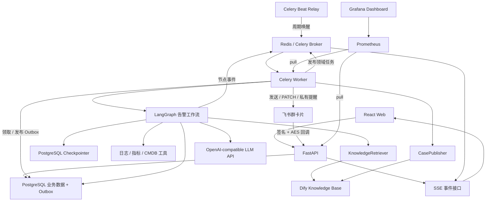
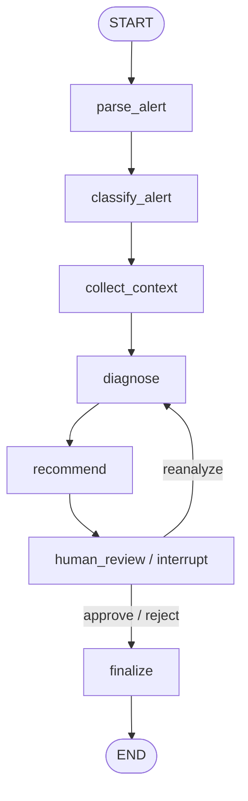

# 技术选型与架构设计

## 1. 架构原则

- 核心告警流程由代码控制，便于测试、版本管理和故障恢复。
- 业务事实、执行快照和临时调度状态分离。
- 第一版采用模块化单体与独立 Worker，不拆微服务。
- 外部系统通过适配器接入，Dify、模型和模拟工具均可替换。
- 数据库是最终事实来源，Redis 不保存不可丢失的业务状态。

## 2. 技术选型

| 层级 | 选型 | 职责 |
| --- | --- | --- |
| Web | React、TypeScript、Vite、Ant Design | 告警列表、详情、确认页面 |
| Web 数据层 | TanStack Query、SSE | 查询缓存、状态刷新、服务端事件 |
| API | FastAPI、Pydantic | 接口、校验、鉴权和持久化投递意图 |
| 数据访问 | SQLAlchemy、Alembic | ORM 和数据库迁移 |
| Agent | LangGraph | 告警工作流、人工中断和恢复 |
| 异步执行 | Celery Worker、Celery Beat Relay | 发布 Outbox、启动/恢复工作流及后台任务 |
| 临时基础设施 | Redis | Celery Broker、缓存、锁和事件发布 |
| 业务存储 | PostgreSQL | 告警、报告、决策、案例、审计事件和 Outbox |
| 工作流快照 | LangGraph PostgreSQL Checkpointer | checkpoint 与恢复 |
| 第一版 RAG | Dify Knowledge Base API | 文档管理、分段和检索 |
| 进阶 RAG | pgvector | 自研混合检索与效果对比 |
| 可观测性 | Prometheus、Grafana、结构化日志 | 指标、看板和排障 |
| 交互渠道 | 飞书企业自建应用、卡片 JSON 2.0 | 群通知、主要状态和人工命令入口 |
| 交付 | Docker Compose | 本地一键启动 |
| 测试 | pytest、Playwright | 单元、集成和端到端测试 |

第一版不引入 Milvus、Kafka、Elasticsearch 和 Kubernetes。当前数据规模下，额外运维成本大于展示收益；需要自研向量检索时优先使用 pgvector。

## 3. 组件职责边界

### 3.1 LangGraph 与 Celery

- LangGraph 决定“下一步执行什么”，维护告警诊断的业务控制流。
- Celery 决定“任务在哪里、何时执行”，负责把 HTTP 请求与耗时工作解耦。
- Celery 的任务结果不是业务事实；页面状态来自 PostgreSQL。
- 工作流暂停时 Celery 任务结束，人工决策到达后创建新的恢复任务。
- API 和工作流不直接承担 Broker 双写；它们在业务事务内写入 Outbox，Beat 周期唤醒 Relay，由 Worker 发布领域任务。

### 3.2 PostgreSQL 与 Redis

- PostgreSQL 保存告警、运行记录、节点事件、报告、决策、案例和待发布的 Outbox 消息。
- LangGraph Checkpointer 在 PostgreSQL 保存可恢复执行快照。
- Redis 用于队列、缓存、短期锁和事件广播，可清空、可重建。
- 告警幂等最终由数据库唯一约束保证，Redis 只能作为快速拦截层。

### 3.3 Dify 的定位

Dify 只作为可替换的知识检索服务，不编排核心告警工作流。

后端定义统一的检索接口：

```python
class KnowledgeRetriever:
    async def retrieve(
        self,
        query: str,
        top_k: int,
        filters: dict | None = None,
    ) -> list[DocumentChunk]:
        ...
```

适配器实现：

- `MockRetriever`：测试和离线开发使用。
- `DifyKnowledgeAdapter`：调用 Dify Knowledge Base API，同时实现检索与案例发布协议。

案例写入知识库使用独立的 `CasePublisher` 协议。V2.1 在保留确定性 `MockCasePublisher` 的同时实现 Dify 发布：以案例 UUID 生成稳定文档名，发布前按精确名称对账，避免重复任务创建重复文档；创建或更新后轮询索引状态，只有 `completed` 才把案例标记为 `synced`。Dify 的响应先通过 Pydantic Schema 校验，再转换为领域对象。

空数据集无需预先创建自定义元数据。V2.1 将案例 ID、症状、根因、处置方案、标签和证据写入结构化 Markdown；来源通过数据集、文档和片段 ID 组合为稳定引用。后续只有在需要按服务、严重级别或时间做服务端过滤时，才引入 Dify 元数据字段和迁移脚本。

后续实现 `PgVectorRetriever`，用同一评测集对比两种检索方案。LangGraph 节点只依赖 `KnowledgeRetriever`，不感知 Dify 的响应格式。

### 3.4 DeepSeek 的定位

DeepSeek 只实现可替换的 `DiagnosticModel` 协议，不负责工作流编排、证据采集、权限、状态流转或工具执行。离线环境由 `MockDiagnosticModel` 提供确定性结果；真实环境由通用 OpenAI-compatible 适配器调用 DeepSeek，领域节点不依赖供应商响应格式。

V2.2 将诊断与建议拆为两次 JSON Mode 调用。每次响应先校验供应商信封，再使用严格 Pydantic Schema 校验业务结构；诊断根因引用还必须属于 Alert Sage 生成的允许证据 ID。Schema 或引用失败时最多进行一次输出修复，网络错误、`429` 和 `5xx` 使用独立的有限重试，鉴权和参数错误不重试。

模型只生成摘要、根因和建议。报告证据、来源、模型名和 Prompt 版本由可信应用代码补齐；告警 payload、人工反馈和证据内容有明确长度上限。所有外部内容都按不可信数据包裹，密钥和供应商响应正文不得进入日志或业务错误。

### 3.5 Prometheus 与 Grafana 的定位

Prometheus 和 Grafana 只保存可重建的运行观测数据，不作为告警、工作流、报告或案例的事实来源。API 在 `/metrics` 暴露单进程 Registry；Celery prefork Worker 在独立端口暴露 multiprocess Registry。Worker 启动脚本只清理专用 `PROMETHEUS_MULTIPROC_DIR` 下的 `*.db` 文件，并在 fork 前完成环境准备。

V2.3 只使用 Counter 和 Histogram，避免 Python 多进程模式不支持或语义受限的 Gauge、Info、自定义 Collector 与 exemplar。所有标签来自固定枚举或声明式路由模板；禁止将 `alert_id`、`workflow_run_id`、实例、任意服务名、检索问题、错误正文或文档 ID 放入指标标签。详细决策见 [ADR 0008](adr/0008-prometheus-grafana-observability.md)。

### 3.6 运行 Profile 与飞书定位

`real/demo/test` Profile 无默认值，供应商选择不再从日志环境推断。真实模式必须使用 DeepSeek 与 Dify；离线模式必须使用 Mock 且拒绝云端密钥。API、Worker 和 Relay 按角色接收最小配置，Relay 不获取供应商或飞书凭据。详细决策见 [ADR 0012](adr/0012-explicit-runtime-profiles.md)。

飞书是可替换的交互适配器，不是告警、运行或决策的事实来源。回调验证、审计事实、工作流命令与 Outbox 在 PostgreSQL 事务中提交；发送端从数据库读取最新状态渲染 revision 卡片。详细决策见 [ADR 0013](adr/0013-feishu-reliable-interaction-channel.md)。

## 4. 总体架构



## 5. 告警工作流



`collect_context` 内部并发调用日志、指标、CMDB 和知识检索工具。每个工具具有独立的超时、重试、错误记录和幂等键。部分工具失败时保留已取得的证据，并在报告中声明信息缺失。

`human_review` 使用持久化 checkpoint。恢复执行时节点可能重新进入，因此暂停前的写操作必须幂等，外部副作用应放在人工批准之后。

V2.5 在 `finalize` 持久化批准终态时，同一数据库事务内生成结构化 `cases` 记录与 `case.sync` Outbox 消息。Relay 发布后由独立 Celery 任务调用 `CasePublisher`；同步失败不会回滚已经确认的业务事实，也不会把外部供应商状态混入 LangGraph checkpoint。

## 6. Web 与 API

V2.1 已定义以下告警、工作流、案例与知识接口：

| 方法 | 路径 | 用途 |
| --- | --- | --- |
| `POST` | `/api/v1/alerts` | 创建模拟告警 |
| `GET` | `/api/v1/alerts` | 查询告警列表 |
| `GET` | `/api/v1/alerts/{id}` | 查询告警详情 |
| `POST` | `/api/v1/alerts/{id}/workflow` | 幂等启动异步诊断 |
| `GET` | `/api/v1/alerts/{id}/workflow` | 查询最新运行、报告和决策 |
| `GET` | `/api/v1/alerts/{id}/events` | 获取节点和工具事件 |
| `GET` | `/api/v1/alerts/{id}/stream` | 订阅 SSE 状态事件 |
| `POST` | `/api/v1/alerts/{id}/decisions` | 批准、驳回或重新分析 |
| `POST` | `/api/v1/alerts/{id}/retry` | 重试失败工作流 |
| `GET` | `/api/v1/alerts/{id}/case` | 查询批准后生成的案例与知识同步状态 |
| `POST` | `/api/v1/alerts/{id}/case/retry` | 重试失败的案例知识同步 |
| `POST` | `/api/v1/knowledge/search` | 使用统一协议检索知识片段并返回来源 |
| `POST` | `/api/v1/integrations/feishu/card-actions` | 验证、解密并幂等处理卡片动作 |
| `GET` | `/api/v1/alerts/{id}/feishu` | 查询飞书 eligibility、revision 与渠道错误 |
| `POST` | `/api/v1/alerts/{id}/feishu/retry` | 重新投递失败的最新共享卡片 |

### 6.1 告警接入契约

V1.1 的告警创建请求：

```json
{
  "source": "web",
  "external_alert_id": "alert-20260718-001",
  "alert_name": "HighCPUUsage",
  "service": "order-service",
  "instance": "order-service-01",
  "severity": "critical",
  "value": 92.5,
  "threshold": 80,
  "started_at": "2026-07-18T14:30:00+08:00",
  "payload": {
    "summary": "CPU usage remained high for five minutes"
  }
}
```

创建接口的幂等键为 `source + external_alert_id`：

- 首次创建返回 `201`、`Location` 响应头及 `X-Idempotent-Replay: false`。
- 相同幂等键和相同内容重复提交，返回原记录、`200` 及 `X-Idempotent-Replay: true`。
- 相同幂等键携带不同告警内容时返回 `409 alert_idempotency_conflict`，不覆盖原记录。
- API 层的预检查用于快速返回，数据库唯一约束负责并发请求下的最终一致性。

列表接口使用 `page`、`page_size` 分页，`page_size` 范围为 1 到 100；支持 `status`、`severity` 和 `service` 精确过滤，默认按 `created_at`、`id` 倒序。V1 数据规模有限，优先选择易于调试的页码分页；需要稳定遍历大规模实时数据时再迁移为游标分页。

人工决策请求：

```json
{
  "idempotency_key": "decision-alert-001-v1",
  "action": "approve",
  "comment": "确认是慢查询导致，可以按照建议处理",
  "actor": "demo-user"
}
```

V1.3C 尚未接入认证，`actor` 是求职演示边界内的审计字段，不是可信身份。接入认证后必须由服务端从身份上下文生成，不能继续信任请求体。

SSE 用于服务器向浏览器单向推送状态，审批仍使用普通 HTTP 请求。服务端先按 `Last-Event-ID` 从 PostgreSQL 补发，再用 Redis Pub/Sub 唤醒查询，并保留周期性数据库轮询；Redis 消息丢失不会丢审计事实。需要双向高频交互前不引入 WebSocket。

### 6.2 V2.1 Web 路由与服务端状态

| 路由 | 页面职责 |
| --- | --- |
| `/alerts` | 告警列表、过滤和分页；查询条件保存在 URL 中 |
| `/alerts/new` | 创建模拟告警，处理成功、字段校验和幂等冲突 |
| `/alerts/:alertId` | 展示业务事实、报告、建议、事件时间线、人工确认、结构化案例和同步重试 |
| `/knowledge` | 输入问题并展示标准化知识片段、相关度、供应商和来源引用 |
| `*` | 应用级 404 |

React Router 使用声明式路由，页面模块按路由懒加载。TanStack Query 只管理 API 服务端状态；筛选和分页使用 URL Search Params，表单临时值由 Ant Design Form 管理，不复制到全局状态。

### 6.3 API 错误与类型契约

业务错误和请求校验错误统一为以下信封，前端不得依赖 FastAPI 默认的 `detail` 结构：

```json
{
  "error": {
    "code": "alert_idempotency_conflict",
    "message": "An alert with this idempotency key already exists with different content",
    "context": {
      "alert_id": "019f73e2-c928-70b2-b37a-10f876a72565",
      "href": "/api/v1/alerts/019f73e2-c928-70b2-b37a-10f876a72565"
    }
  }
}
```

`context` 仅携带调用方可安全使用的结构化信息；`422` 在 `context.issues` 中返回字段、消息和错误类型，不回显敏感原始输入。后端导出 `openapi/openapi.json`，前端使用固定版本的生成器生成 `frontend/src/api/generated`。生成文件不手工编辑，契约变化时必须先重新导出 OpenAPI，再生成类型并运行前后端测试。

### 6.4 V2.4 日志关联与时间线

API 为每个请求生成 UUID `request_id`，在响应 `X-Request-ID` 中返回；调用方可另传经过白名单校验的 `X-Client-Request-ID`。启动、恢复、重试和案例同步任务通过 Celery headers 传播关联上下文，Worker 再从 PostgreSQL 补齐告警、运行、线程和案例 ID。API、Worker、LangGraph 节点、上下文工具、DeepSeek 与 Dify 使用同一 JSON 字段契约。

日志只写容器标准输出，是可丢失的运行态数据；`workflow_events` 仍是时间线、审计与 SSE 补发的业务事实。新事件在 `payload.correlation` 中保存产生它的请求 ID，页面据此展示跨请求阶段。相邻事件的时间差只代表阶段间隔，不能代替节点精确耗时；精确耗时由结构化日志和 Prometheus Histogram 提供。当前不引入 Loki、Elasticsearch 或 OpenTelemetry Collector。

### 6.5 V2.5 事务性 Outbox

工作流启动、人工恢复、失败重试、案例同步、飞书共享卡片和私有提醒均在业务事实变更的同一事务中创建严格类型的 Outbox 消息。API 的兼容字段 `dispatched` 表示“本次请求新建了持久化投递意图”，不表示 Redis 已确认接收；幂等重放返回 `false`。

Relay 使用 `FOR UPDATE SKIP LOCKED` 分批领取到期消息。发布失败保持 `pending`，仅记录脱敏错误类型，并以有上限的指数退避重试；发布成功但数据库提交前崩溃时允许重复投递，因此整体为至少一次语义。消费者通过业务状态锁、唯一约束、事件幂等键和供应商幂等键吸收重复。详细决策见 [ADR 0010](adr/0010-transactional-outbox.md)。

## 7. 建议目录结构

```text
alert-sage/
├─ backend/
│  ├─ app/
│  │  ├─ api/v1/routes/          # 告警、决策、事件和健康检查接口
│  │  ├─ core/                   # 配置、异常、日志和安全
│  │  ├─ db/                     # Session、数据库初始化
│  │  ├─ models/                 # SQLAlchemy 持久化模型
│  │  ├─ schemas/                # Pydantic API/领域数据结构
│  │  ├─ repositories/           # 数据访问边界
│  │  ├─ services/               # 应用服务和事务编排
│  │  ├─ workflows/alert/
│  │  │  ├─ graph.py             # LangGraph 图定义
│  │  │  ├─ state.py             # 工作流状态结构
│  │  │  ├─ nodes.py             # 七个纯编排节点
│  │  │  ├─ adapters.py          # 工具与诊断模型协议、模拟实现
│  │  │  ├─ checkpoint.py        # PostgreSQL Checkpointer 生命周期
│  │  │  └─ service.py           # 业务事务、事件和恢复编排
│  │  ├─ tools/                  # 日志、指标、CMDB、案例工具
│  │  ├─ integrations/
│  │  │  ├─ knowledge/           # Dify/Mock 知识检索与案例发布适配器
│  │  │  └─ llm/                 # OpenAI-compatible/Mock 诊断模型适配器
│  │  ├─ tasks/                  # Celery 领域任务、Outbox Relay 与 Worker 入口
│  │  └─ observability/          # 指标、追踪和审计辅助代码
│  ├─ migrations/                # Alembic 迁移
│  └─ tests/
│     ├─ unit/
│     ├─ integration/
│     └─ fixtures/
├─ frontend/
│  ├─ src/
│  │  ├─ api/                    # API Client 与 SSE Client
│  │  ├─ components/             # 通用组件
│  │  ├─ features/alerts/        # 告警领域页面和组件
│  │  ├─ pages/                  # 列表、详情和创建页面
│  │  ├─ routes/                 # 路由定义
│  │  └─ types/                  # TypeScript 数据类型
│  └─ tests/                     # 前端测试
├─ tests/e2e/                    # Playwright 端到端测试
├─ docs/                         # 设计与使用文档
├─ infra/
│  ├─ prometheus/                # Prometheus 配置
│  └─ grafana/                   # Dashboard 与数据源配置
├─ scripts/                      # 初始化、导入样例和演示脚本
├─ docker-compose.yml
├─ .env.example
└─ README.md
```

API 和 Celery Worker 共享 `backend/app` 中的领域与工作流代码，只使用不同启动入口。第一版不建立多个后端服务仓库。

## 8. 可观测性

V2.3 已提供以下指标族：

- HTTP：请求总数和耗时，标签为方法、声明式路由模板及状态码。
- 工作流：启动、恢复、重试的执行总数与耗时，以及七个 LangGraph 节点耗时。
- 工具：各上下文工具的调用结果与耗时。
- LLM：按供应商、模型和操作记录请求结果、耗时、传输重试和结构化输出修复。
- 知识服务：Dify/Mock 检索与发布的结果、耗时及检索片段数量。
- 案例同步：按知识供应商和同步终态记录任务总数与耗时。
- Outbox：按消息主题记录发布成功/失败、投递耗时和失败后的退避时长。

Dashboard 以十一个面板展示 API 速率/P95、工作流和节点 P95、工具 P95、LLM 与知识服务 P95、Worker 进程累计模型成功率、重试、输出修复、案例同步及 Outbox 投递。V2.4 已补充结构化日志关联 ID 和以 PostgreSQL 审计事件为事实来源的单次诊断可视化时间线；二者与聚合指标互补，不能相互替代。

## 9. 可靠性约束

- 业务事实与 Outbox 投递意图必须在同一 PostgreSQL 事务中提交；Broker 失败不得回滚业务事实或丢失投递意图。
- Outbox 与 Celery 提供至少一次投递，所有消费者必须能安全处理重复执行。
- 每次工具调用使用稳定的 `idempotency_key`。
- LLM 输出必须经过结构化 Schema 校验，失败时允许修复或重试。
- LLM 根因只能引用应用生成的证据 ID；模型不得创建来源或覆盖模型/Prompt 版本元数据。
- 外部告警、反馈和检索片段在进入模型前必须按长度预算裁剪，并作为不可信数据隔离。
- 重试仅覆盖可恢复错误，不对参数错误和权限错误盲目重试。
- 人工决策只能作用于 `waiting_for_approval` 的运行。
- 最终报告、人工决策和案例写入均保留版本与审计信息。
