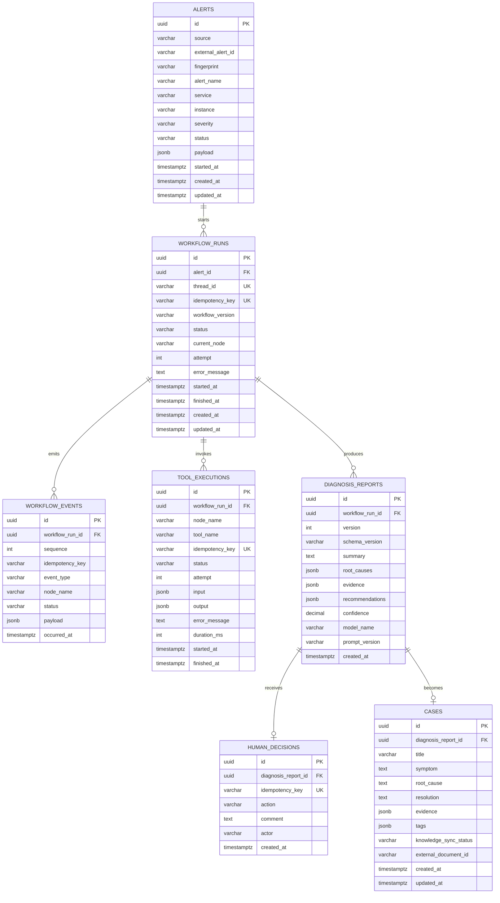

# 核心数据模型

> 实现状态：V1.3C 已将这些业务表接入工作流 API、Celery Worker、SSE 和 Web 人工确认；`cases` 仍属于后续闭环增量。

## 1. 建模目标

核心数据模型需要同时支持：

- 告警幂等接入。
- 多次执行、重试和重新分析。
- 节点及工具调用可观测。
- 人工决策可审计。
- 诊断报告版本化。
- 已确认案例沉淀。
- LangGraph checkpoint 与业务状态分离。

所有主键使用 UUID，时间统一以带时区的 UTC 时间存储。结构化但可能演进的输入、证据和模型输出使用 PostgreSQL `JSONB`。

## 2. 实体关系



## 3. 表定义

### 3.1 `alerts`

保存外部告警和当前对外状态。

关键字段：

| 字段 | 说明 |
| --- | --- |
| `source` | 告警来源，第一版固定为 `web` |
| `external_alert_id` | 来源系统中的告警 ID |
| `fingerprint` | 根据服务、实例、告警名等生成的稳定指纹 |
| `status` | 页面展示的业务状态 |
| `payload` | 未丢失信息的原始告警 JSON |

约束与索引：

- 唯一约束：`UNIQUE(source, external_alert_id)`。
- 普通索引：`status`、`service`、`severity`、`created_at DESC`。
- `external_alert_id` 负责请求幂等；`fingerprint` 为后续相似告警聚合预留。

### 3.2 `workflow_runs`

一次告警可以有多次运行，例如人工触发重试；一次运行内部可以产生多版诊断报告。

关键字段：

- `thread_id`：传给 LangGraph Checkpointer 的稳定游标，全局唯一。
- `idempotency_key`：工作流启动命令的全局幂等键，防止 API 或任务重复投递创建第二次运行。
- `workflow_version`：记录图结构版本，避免升级后无法解释旧状态。
- `current_node`：供页面快速展示，不替代 checkpoint。
- `attempt`：运行级重试次数。

约束与索引：

- `UNIQUE(thread_id)` 和 `UNIQUE(idempotency_key)`。
- 索引：`alert_id`、`status`、`updated_at`。
- 同一告警同一时刻最多存在一个活动运行，由覆盖 `queued`、`running`、`waiting_for_approval`、`reanalyzing` 的 PostgreSQL 部分唯一索引保证。

### 3.3 `workflow_events`

追加写入的业务事件流，用于时间线、审计和 SSE 补发。

常见 `event_type`：

```text
workflow_started
workflow_queued
node_started
node_completed
node_failed
tool_started
tool_completed
tool_failed
human_input_required
human_decision_received
workflow_completed
workflow_rejected
workflow_failed
```

事件不可原地修改。每个运行内的 `sequence` 从 1 递增，并与 `workflow_run_id` 组成唯一约束；SSE 客户端使用序号作为断点补发断线期间的事件。`(workflow_run_id, idempotency_key)` 防止恢复或重试时追加重复事件。

### 3.4 `tool_executions`

记录日志、指标、CMDB 和知识检索等工具调用。

`idempotency_key` 建议由以下信息生成：

```text
workflow_run_id + node_name + tool_name + normalized_input_hash
```

唯一约束确保 Celery 重试或 LangGraph 恢复时能够复用已完成结果，而不是重复调用有副作用的外部系统。

每次执行还保存 `node_name`、状态、尝试次数、输入输出、错误码、错误消息和耗时；输入输出为 JSONB，但不得写入未脱敏的密钥或凭证。

### 3.5 `diagnosis_reports`

每次初次诊断或重新分析生成一个新版本，不覆盖旧报告。

推荐的 `evidence` 元素结构：

```json
{
  "type": "metric",
  "source": "mock-prometheus",
  "title": "CPU 与请求量同时上升",
  "content": "14:20 后 CPU 从 45% 上升至 92%",
  "reference": "metric://order-service-01/cpu?from=14:20",
  "score": 0.96
}
```

约束：

- `UNIQUE(workflow_run_id, version)`。
- `confidence` 范围为 0 到 1。
- `schema_version` 固定当前结构版本，便于后续兼容旧报告。
- LLM 输出先通过 Pydantic Schema 校验后才能入库。

### 3.6 `human_decisions`

记录对某一版诊断报告的人工反馈。

`action` 仅允许：

```text
approve
reject
reanalyze
```

决策写入与运行状态变更应处于同一数据库事务中。接口需要防止对已结束运行重复审批。

每份报告最多接受一个决策，`idempotency_key` 全局唯一；`reanalyze` 必须提供非空反馈。数据库约束负责最终一致性，Pydantic Schema 负责在进入事务前返回可理解的校验错误。

### 3.7 `cases`

只有批准后的诊断报告才生成案例。案例同时保留结构化内容和外部知识库同步信息。

`knowledge_sync_status`：

```text
pending
syncing
synced
failed
```

`external_document_id` 保存 Dify 文档 ID；同步失败不影响告警工作流完成，但需要可重试。

## 4. LangGraph 状态

LangGraph State 是执行期间的数据载体，不直接等同于数据库 ORM 模型。V1.3A 使用 Pydantic 严格模型作为运行时边界，未来节点接收其 JSON 模式输出：

```python
class AlertWorkflowState(BaseModel):
    schema_version: Literal["1.0"]
    alert_id: UUID
    workflow_run_id: UUID
    thread_id: str
    alert: dict[str, JsonValue]
    classification: dict[str, JsonValue] | None
    contexts: dict[str, ContextSnapshot]
    tool_errors: list[WorkflowToolError]
    diagnosis: dict[str, JsonValue] | None
    recommendations: list[dict[str, JsonValue]]
    report_id: UUID | None
    report_version: int
    human_decision: WorkflowHumanDecision | None
    decision_idempotency_key: str | None
    reanalysis_count: int
    final_status: Literal["completed", "rejected"] | None
    warnings: list[str]
```

状态设计约束：

- 只放可序列化数据，不放数据库 Session、HTTP Client 或函数对象。
- 大型日志全文保存在业务表或对象存储，State 仅保留摘要和引用。
- 并行节点写同一字段时使用明确 reducer，避免结果互相覆盖。
- `workflow_run_id` 与 `thread_id` 分工明确：前者是业务运行 ID，后者是 checkpoint 游标。

### 4.1 Checkpoint 表

`checkpoints`、`checkpoint_blobs`、`checkpoint_writes` 和 `checkpoint_migrations` 由官方 `langgraph-checkpoint-postgres` 的 `setup()` 管理，不纳入项目 Alembic ORM 元数据。Alembic 自动差异检查显式忽略这四张供应商表，避免生成误删除迁移。

Checkpoint 只保存 JSON 安全的图状态；反序列化器禁用任意 JSON/MessagePack 模块导入。业务查询、审计与权限判断仍然只读取项目业务表。

### 4.2 状态转换护栏

状态修改必须经过 `app.workflows.alert.transitions`，相同状态重复投递视为幂等 no-op。主要路径为：

```text
received -> running -> waiting_for_approval -> completed
                                  |-> rejected
                                  |-> reanalyzing -> waiting_for_approval
running / reanalyzing -> failed -> running
```

工作流运行以 `queued` 开始；失败运行可以重新进入 `queued` 并增加 `attempt`。`completed` 和 `rejected` 是终态，不允许恢复为活动状态。

## 5. 状态来源优先级

| 状态类型 | 事实来源 |
| --- | --- |
| 告警是否存在、当前业务状态 | PostgreSQL 业务表 |
| 工作流恢复位置及节点快照 | LangGraph Checkpointer |
| 页面时间线和审计记录 | `workflow_events` |
| 任务是否正在某 Worker 执行 | Celery/Redis 临时状态 |
| 实时页面通知 | Redis Pub/Sub，断线后由事件表补偿 |

Celery 和 Redis 状态不可用于判断告警最终是否完成。

## 6. 后续数据模型

以下模型在第一版闭环稳定后再加入：

- `outbox_messages`：解决数据库提交与 Celery 投递之间的双写一致性。
- `knowledge_documents`、`knowledge_chunks`：自研 pgvector 检索。
- `rag_evaluation_sets`、`rag_evaluation_results`：检索效果评测。
- `users`、`roles`：真实认证与权限。
- `alert_groups`：告警聚合与抑制。
