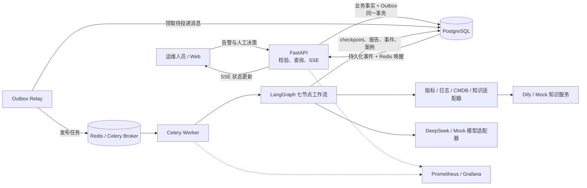
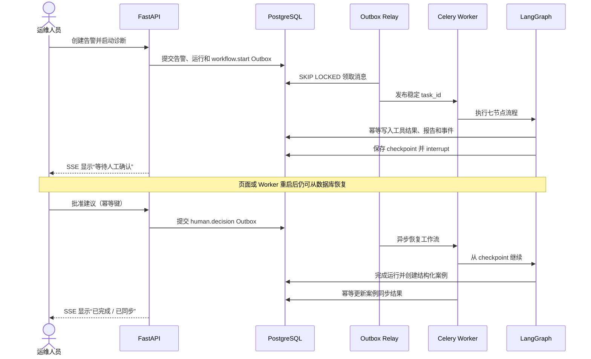
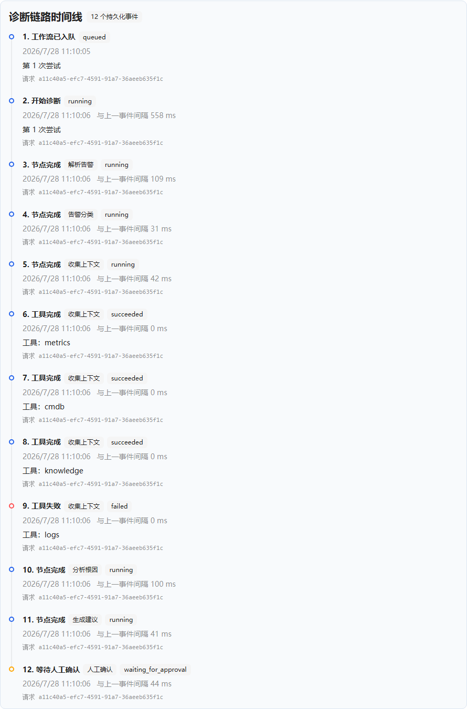
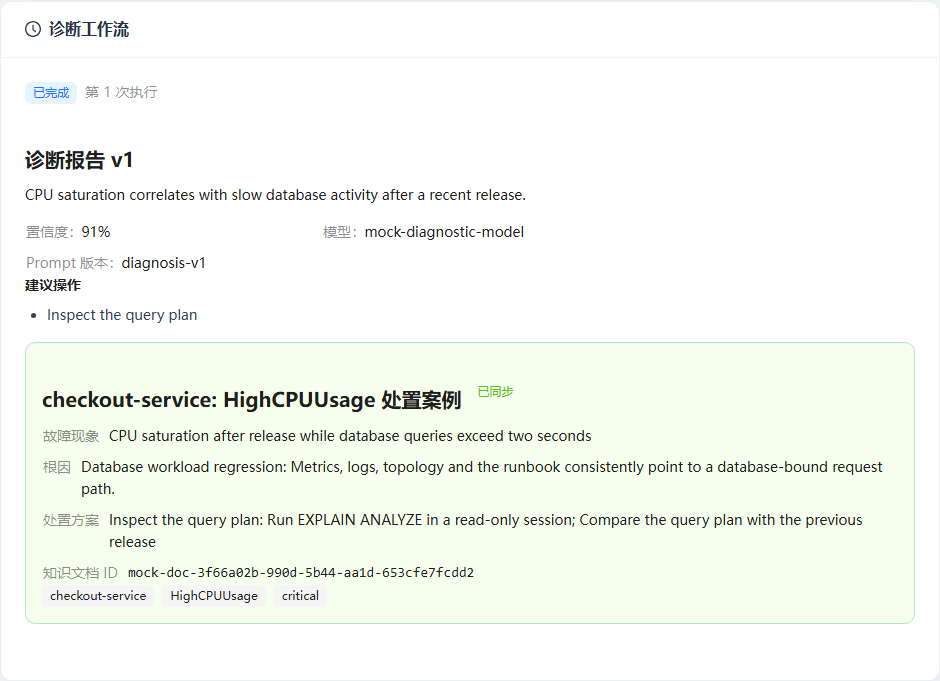

# 求职展示指南

## 1. 一句话定位

Alert Sage 是一个面向运维告警的 AI 诊断助手。它把告警接入、上下文采集、结构化诊断、人工确认和案例沉淀组织成可恢复、可审计的异步工作流，而不是把大模型响应直接当作业务事实。

五分钟展示的成功标准不是浏览所有页面，而是让面试官理解三件事：

1. AI 和外部工具可能失败，但业务状态不会因此丢失或伪造。
2. 人工确认是可恢复的状态机节点，不是前端临时弹窗。
3. 批准结果最终沉淀为可检索案例，并且整个链路可以追溯。

## 2. 系统架构



关键边界：PostgreSQL 保存业务事实与恢复位置；Redis 只承载可重建的队列、锁和广播；Dify 与 DeepSeek 均可替换，且不编排核心流程。

## 3. 人工中断与恢复



这里不承诺消息“恰好一次”。系统采用至少一次投递，并通过稳定任务 ID、数据库唯一约束和业务幂等键吸收重复执行。

## 4. 三张核心证据

### 4.1 结构化报告与人工门控


讲解重点：模型输出先通过 Schema 与证据引用校验，工作流随后停在 LangGraph `interrupt`；批准、拒绝和重新分析是显式状态转换。

### 4.2 单个工具失败但流程降级继续



讲解重点：`metrics`、`cmdb` 和 `knowledge` 成功，`logs` 在受限故障注入下失败；系统记录失败而不伪造日志证据，仍使用剩余上下文生成报告。每一步都是 PostgreSQL 中的审计事件。

### 4.3 批准后沉淀结构化案例



讲解重点：案例创建与业务完成状态可追溯，知识同步由独立 Outbox/Celery 任务执行；页面显示的是数据库事实，不是 Celery Result Backend 的临时结果。

这些图片由 Mock 供应商生成，用于稳定展示工程链路，不用于证明真实模型质量。真实 Dify 与 DeepSeek 能力通过供应商适配器验收记录和 RAG 固定评测报告说明。

## 5. 五分钟讲解脚本

| 时间 | 操作 | 讲解重点 |
| --- | --- | --- |
| 0:00–0:35 | 打开 README 和架构图 | 先说运维痛点：信息分散、模型不可靠、自动操作风险高。 |
| 0:35–1:20 | 运行 `start-demo.ps1`，打开告警详情 | API 不同步等待诊断；事务性 Outbox 解决数据库提交与任务投递之间的双写问题。 |
| 1:20–2:15 | 展示报告和人工确认 | LangGraph checkpoint 保存在 PostgreSQL，刷新页面或重启 Worker 不会丢失确认位置。 |
| 2:15–3:05 | 滚动到诊断时间线 | 指出 `logs` 失败与其他三个工具成功；这是部分失败降级，不是假装所有工具都成功。 |
| 3:05–3:50 | 批准建议并等待完成 | 决策有幂等键，恢复节点可以重复进入；案例创建和知识同步各自具备数据库约束。 |
| 3:50–4:30 | 展示已同步案例与 Grafana | PostgreSQL 是事实来源，日志、指标和请求 ID 用于跨 API、Relay、Worker 复盘。 |
| 4:30–5:00 | 打开 RAG 评测对比页或总结 | Dify 只负责知识能力，固定评测集比较 Recall、MRR、拒答和延迟，核心流程不被供应商锁定。 |

推荐开场：

> 这个项目想解决的不是“模型能不能猜中根因”，而是当模型、日志系统或消息队列不可靠时，诊断流程能不能继续、恢复和审计。

推荐收尾：

> 我把 AI 当成受约束的系统组件：它提供推理能力，但状态、权限、幂等和最终决策仍由确定性的工程边界控制。

## 6. 能力证据映射

| 工程主张 | 实现位置 | 现场证据 | 自动验证 |
| --- | --- | --- | --- |
| 数据库与任务投递一致性 | 事务性 Outbox + Relay | Redis 故障恢复记录 | 后端 Outbox 集成测试 |
| 人工节点可恢复 | LangGraph PostgreSQL checkpoint | 刷新后仍等待确认 | Playwright 主路径 |
| 工具部分失败可降级 | 并发工具适配器与失败事件 | `logs` 失败时间线 | 工具故障注入测试 + Playwright |
| LLM 输出不直接入库 | Pydantic Schema、证据引用和修复边界 | 版本化结构化报告 | 模型适配器测试 |
| 重复请求不产生重复事实 | API 幂等键、唯一约束、稳定 task ID | 相同告警返回原详情 | API 并发测试 + Playwright 重放 |
| RAG 策略可比较 | 固定评测集、独立 Dataset、逐题持久化 | 双运行对比页 | 评测契约与执行测试 |
| 全链路可复盘 | 结构化日志、Prometheus、持久化事件 | Grafana 与诊断时间线 | 指标、日志关联测试 |

## 7. 常见追问

**为什么不用 Dify 编排整个 Agent？**

核心流程包含幂等、事务、人工中断和恢复，应该由可测试的状态机控制。Dify 保留为可替换知识服务，既发挥知识库能力，也避免供应商成为业务状态事实来源。

**为什么 PostgreSQL 和 Redis 都需要？**

PostgreSQL保存不可丢失的业务事实、Outbox 和 checkpoint；Redis 负责吞吐敏感但可重建的队列、短期锁和事件唤醒。Redis 丢失不会改变告警最终状态。

**如何保证不会重复执行？**

系统不假设 Broker 提供恰好一次。生产者使用稳定 Outbox 消息与 Celery task ID，消费者使用幂等键和数据库约束，重复发布或节点重入不会创建第二份业务事实。

**LLM 给出危险建议怎么办？**

输出必须通过结构化 Schema、证据引用和业务校验；有副作用的工具不自动执行，第一版只生成建议并要求人工确认。

**为什么仍然是模块化单体？**

当前规模的复杂度来自可靠性而不是团队边界。模块化单体更容易维持事务一致性和本地复现；只有负载、发布节奏或组织所有权证明必要时才拆服务。

**项目当前没有解决什么？**

尚未接入真实 Prometheus、Loki 和 CMDB，未实现认证与 RBAC，也不自动执行重启、扩缩容或发布。这些是明确边界，不应在演示中描述为已完成功能。

## 8. 演示与离线备用路径

准备人工确认现场：

```powershell
.\scripts\start-demo.ps1
```

全自动批准验收：

```powershell
.\scripts\start-demo.ps1 -Approve
```

重新生成本页图片：

```powershell
.\scripts\capture-showcase.ps1
```

所有命令都可以使用 Mock 供应商，不依赖面试现场网络。若浏览器、Docker 或投影环境临时异常，按本页三张版本化图片和能力证据表继续讲解，不临时切换到真实云端密钥。
